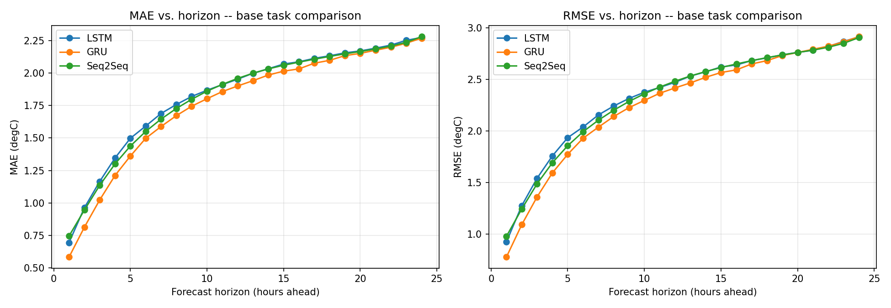
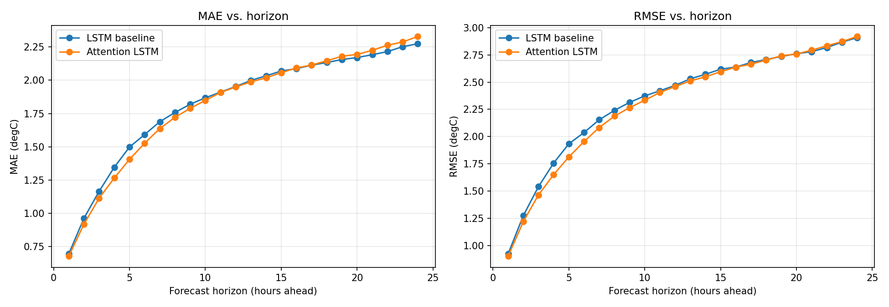
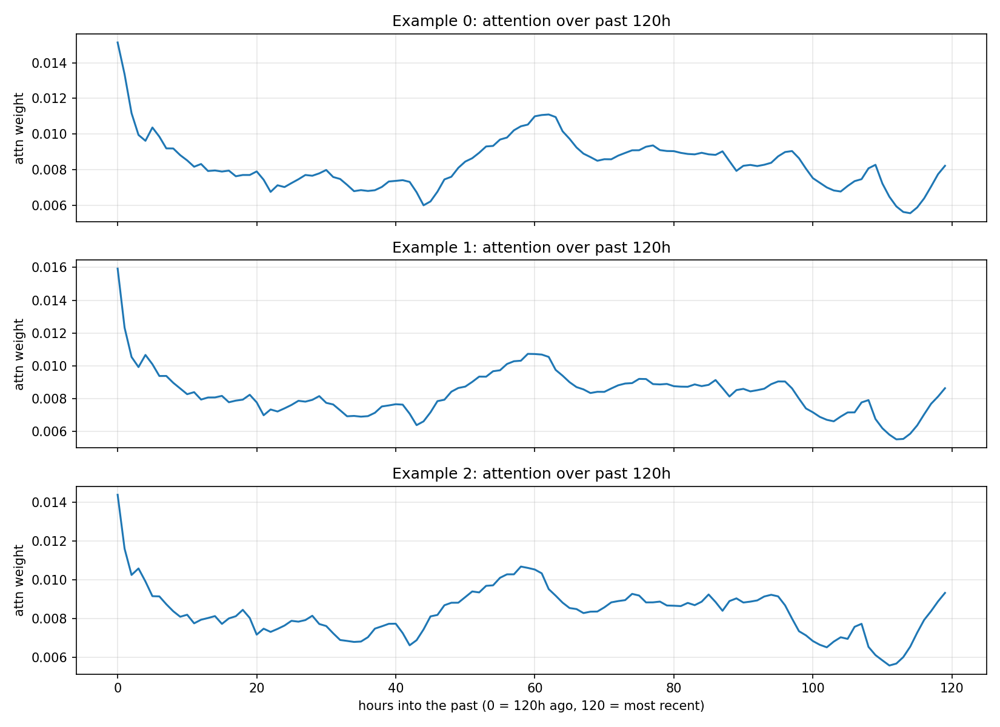
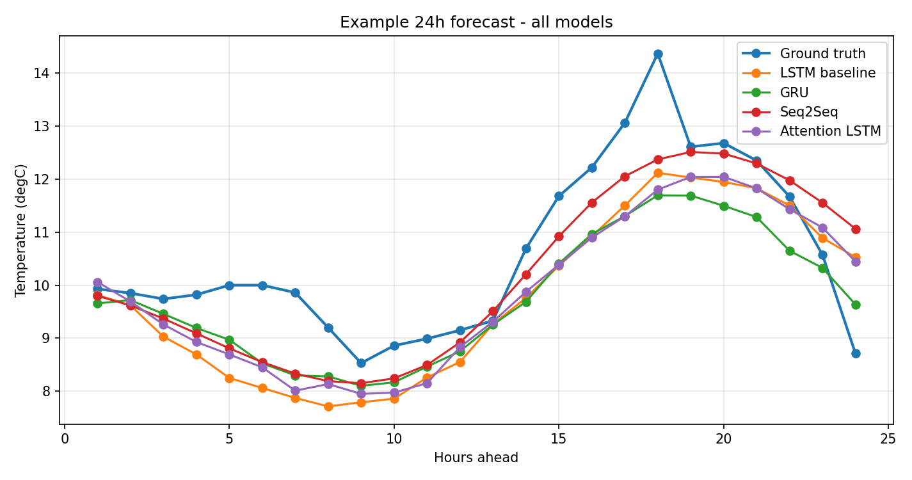

# RNN-1: Multivariate Weather Forecasting with an Attention-Augmented LSTM

## 1. Problem & Data

The task is to forecast temperature from historical weather sensor readings using a recurrent
architecture, and specifically to build and compare three approaches — LSTM, GRU, and a simple
sequence-to-sequence model — before proposing an original improvement on top of one of them. I
used the Jena Climate dataset (Max Planck Institute for Biogeochemistry), resampled to hourly
resolution (keeping every 6th reading from the original 10-minute data, mostly to keep sequence
lengths and training time manageable while still capturing daily temperature cycles).

I used six input features (pressure, temperature, relative humidity, specific humidity, wind
speed, wind direction) and forecast temperature specifically. The setup: given the past 120
hours (5 days), forecast the next 24 hours in one shot for the LSTM/GRU baselines (direct
multi-step output), or one step at a time for the seq2seq model (autoregressive). I split the
data chronologically into 70% train / 15% validation / 15% test, giving 48,920 / 10,371 / 10,371
windowed samples — chronological rather than random, since shuffling a time series before
splitting would leak future information into training.

## 2. Method

Four models, all sharing the same encoder input (120 hours x 6 features) and the same training
setup, differing only in architecture:

- **LSTM baseline**: single-layer LSTM, final hidden state -> linear layer -> all 24 forecast
  steps at once.
- **GRU baseline**: identical structure, GRU instead of LSTM.
- **Simple seq2seq baseline**: an LSTM encoder compresses the input as before, but instead of one
  dense layer producing all 24 steps, an LSTM-cell decoder predicts one step at a time and feeds
  its own prediction back in as the next input — seeded with the last known true temperature value
  from the input window. This is a genuinely different mechanism from the other two, not just a
  relabeled direct-output model.
- **Attention LSTM** (the original contribution, described below): same encoder as the LSTM
  baseline, but instead of using only the final hidden state, it computes a Luong-style
  attention-weighted context vector over *all* past hidden states.

All four were trained with the same seed, optimizer (Adam, lr=1e-3), batch size (128), and
early-stopping protocol (up to 30 epochs, patience 4 on validation loss, best checkpoint
reloaded). This matters because different architectures overfit at different rates, and
comparing everyone at a fixed epoch count would unfairly penalize whichever one overfits faster.

## 3. Original Contribution

My hypothesis going in was that adding attention over the LSTM's past hidden states (instead of
relying only on the final one) would help more at *longer* forecast horizons than short ones.
The reasoning: at 1-hour-ahead, the most recent reading already carries most of the signal, so a
plain LSTM should do fine. At 24-hours-ahead, I expected the model would benefit from being able
to directly reference a relevant pattern from earlier in the window instead of routing everything
through one compressed final state. This contribution is specifically layered on top of the LSTM
baseline (not the GRU or seq2seq model), since that's the architecture the attention mechanism was
built around.

One thing I ran into early on: my first training run (before I added early stopping) showed the
attention model doing worse than the baseline overall, which contradicted what I expected. Looking
at the training curves, both models were overfitting after epoch 5 or so, and the attention model
— having more parameters — was overfitting harder, so I was really comparing whichever model
overfit *less* by a fixed epoch count rather than their actual forecasting ability. Adding early
stopping with best-checkpoint reloading fixed this and is reflected in the setup described above.

## 4. Experiments

All four models were evaluated on the same held-out test set (10,371 windows), with per-step MAE
and RMSE computed across all 24 forecast steps (not just an averaged single number), since the
hypothesis is specifically about how error behaves across the horizon, and an aggregate number
would hide that. I look at this in two stages: first the three base-task architectures against
each other (Section 5.1), then the LSTM baseline against the attention model specifically
(Section 5.2), since that second comparison is where the actual hypothesis is being tested.

## 5. Results & Analysis

### 5.1 Base task comparison: LSTM vs. GRU vs. Seq2Seq

| Model | Mean MAE (°C) | Mean RMSE (°C) |
|---|---|---|
| LSTM | 1.831 | 2.336 |
| GRU | **1.765** | **2.264** |
| Seq2Seq | 1.819 | 2.320 |

*Figure 1: Per-step MAE (left) and RMSE (right) across the 24-hour horizon for the three base
architectures.*

GRU comes out ahead of both LSTM and the seq2seq model, and by a margin that holds fairly
consistently across the whole horizon in Figure 1, not just on average. Its curve sits visibly
below the other two starting from step 1 and stays there through step 24. I didn't go in
expecting a strong difference between LSTM and GRU on a problem like this (they're similar
enough that I'd have accepted either result), so it's worth noting this without overselling it:
GRU has fewer parameters than LSTM (no separate cell state), which on a training set of this
size may simply be slightly less prone to overfitting, consistent with GRU's early-stopping log
running longer (10 epochs before triggering) and reaching a lower best validation loss (0.0810)
than the LSTM's (0.0836 at epoch 5).

The seq2seq model is more interesting relative to my expectations. Since it decodes
autoregressively (each predicted step feeds into the next), I expected it to accumulate error
faster than the direct multi-step models, especially at longer horizons (a well-known failure
mode of autoregressive decoding). Figure 1 shows the seq2seq model actually starts out *worse*
than LSTM at step 1 (0.74°C vs. 0.68°C MAE) but the two converge and become very close for most
of the remaining horizon, with seq2seq sometimes very slightly ahead of LSTM at points in the
middle of the range. So the error-accumulation effect I expected either isn't very pronounced
here, or it's being offset by something else, possibly that seeding the decoder with the true
last-known temperature value gives it a reasonably strong anchor to correct from at each step,
which may be doing more to stabilize it than I initially gave it credit for.

### 5.2 Original contribution: LSTM baseline vs. attention

| Model | Mean MAE (°C) | Mean RMSE (°C) |
|---|---|---|
| LSTM baseline | 1.831 | 2.336 |
| Attention LSTM | 1.819 | 2.305 |

*Figure 2: Per-step MAE (left) and RMSE (right) across the 24-hour forecast horizon, LSTM
baseline vs. attention model.*

On aggregate, attention wins by a small margin, mirroring the direction of its validation loss
advantage during training (0.0812 vs. 0.0836 best val MSE). But per-step, this is the opposite of
what I hypothesized. Figure 2 shows attention tracking visibly below the baseline (better) for
roughly the first 9-10 steps, converging and crossing somewhere around step 10-11, and from there
the baseline is consistently at or below attention for the remaining horizon, with the gap
widening slightly by step 24. Confirmed numerically: the MAE gap (baseline minus attention) is
+0.0175 at step 1 (attention better) and -0.0548 at step 24 (attention worse).

*Figure 3: Attention weight distribution over the 120-hour input window, for three example
test-set forecasts (position 0 = 120 hours before the forecast origin / oldest, position 120 =
most recent).*

Figure 3 is where my original story falls apart, and the actual pattern is more interesting than
either "recency bias" or "24-hours-back periodicity," which were my two candidate guesses going
in. Across all three examples, the single largest attention weight by a clear margin sits at
position 0 — the *oldest* timestep in the 120-hour window, not the most recent one. From there it
drops sharply over the first ~10 hours, settles into a noisy mid-range band, shows a mild
secondary bump around position 55-65 (roughly 2.5 days before the forecast origin), and only rises
modestly toward the most recent hours at the right edge — nowhere near as pronounced as the spike
at position 0. Neither of my original guesses was right: there's no clean daily-periodicity spike
exactly 24 hours back, and the most recent hours don't dominate either. If anything, the model
seems to be anchoring most heavily on the start of the input window, which is a mechanism I hadn't
considered, possibly it's using the oldest reading as a fixed reference point against which more
recent change is measured, though I'd want to look at more examples before being confident about
that interpretation.

This complicates the horizon-based explanation for why attention helps at short horizons. It
doesn't seem to come from simple recency-weighting, since recency isn't where most of the
attention mass goes. It's possible the short-horizon benefit comes instead from the combination of
the oldest-timestep anchor and the mid-window bump giving the model slightly more informative
context than the baseline's single compressed hidden state, even without a clean, easily
narrated mechanism behind it, and that this extra context helps most when the target is close
enough that small corrections still matter, but stops mattering once the 24-hour-out forecast is
dominated by weather's intrinsic unpredictability regardless of how good the input context is.

*Figure 4: A single test-set example — ground truth vs. all four models, across the full 24-hour
forecast.*

Figure 4 gives an intuitive feel for how the four models actually behave on one real example,
beyond the aggregate curves. All four track each other fairly closely for most of the horizon,
and all four clearly underestimate the sharp peak around hour 18 (ground truth reaches about
14.4°C; the closest model, seq2seq, only reaches about 12.5°C, with LSTM, GRU, and attention
clustering lower around 11.7-12.1°C). All four also miss the steep drop at the very end (ground
truth falls to 8.7°C by hour 24, while every model is still predicting somewhere around
10.4-11.6°C). Interestingly, seq2seq tracks visibly closer to the ground truth than the other
three during the rising segment from hour 13 onward in this particular example, which is a
different picture than the aggregate MAE numbers in Section 5.1 would suggest on their own — a
reminder that a single example can highlight behavior (like how well a model tracks a sharp
directional change) that per-step averages smooth over. LSTM and attention track almost
identically to each other throughout this example, which fits with how close their aggregate
numbers are.

## 6. Discussion & Observation

**1. What would attention learn to "look back" at, and would the gain be larger at short or long
horizons?**

Going in, I expected it to find daily periodicity (attending back roughly 24 hours to catch a
similar time-of-day pattern) and I expected that to matter more at long horizons. What I
actually found in Figure 3 was neither that nor a simple recency bias: the dominant attention
weight sits at the *oldest* point in the input window (120 hours back), with a much smaller
secondary bump around 55-65 hours back and only a mild increase toward the most recent hours.
None of the three examples show a clean spike at exactly 24 hours back, so the daily-periodicity
story doesn't hold up. I don't have a fully satisfying mechanistic explanation for why the model
anchors so heavily on the oldest timestep specifically. My best guess is that it's being used as
a stable reference point the model measures more recent change against, but that's speculation
rather than something I can confirm from the attention weights alone. What I can say with more
confidence is the horizon result: the gain over the baseline is larger at short horizons and
crosses over to a loss around step 10-11, and whatever attention is actually doing with that
oldest-timestep anchor and the mid-window bump, it stops being useful once the target is far
enough out that near-term context — recent or otherwise — no longer meaningfully constrains the
forecast.

**2. What does an RNN's sequential inductive bias buy you that a Transformer lacks, and when
would you still bet on the RNN?**

An RNN processes the sequence with a built-in assumption that order matters and that context
should be accessible without any additional learned mechanism — that structure is "free" in the
architecture rather than something the model has to learn from data. A Transformer has no such
built-in bias; it has to learn positional relationships and any notion of recency or ordering
purely from data and positional encodings. Having now trained three different recurrent
variants on this problem (LSTM, GRU, seq2seq) plus an attention-augmented one, I'd add a more
specific observation to this: even the simplest of the three baselines (GRU, with the fewest
parameters) came out ahead of the other two on this dataset, which suggests that for a problem
with this much data and this level of complexity, extra architectural machinery — whether that's
LSTM's extra cell state, seq2seq's autoregressive decoder, or attention's extra context vector —
doesn't automatically pay for itself. For a dataset like this one — 120 hourly time steps, a
single well-behaved sensor stream, and a comparatively modest amount of training data by deep
learning standards — I'd bet on a recurrent model over a Transformer, and specifically I'd now
lean toward the simplest recurrent variant that gets the job done rather than assuming more
architectural sophistication is automatically better. I'd expect a Transformer to pull ahead
mainly with substantially more training data or considerably longer sequences, where the RNN's
strictly sequential processing becomes a genuine bottleneck rather than a helpful bias — neither
of which is really the case here.

## 7. Limitations & Next Steps

The dataset resampling to hourly resolution throws away the finer 10-minute structure, which
could matter for genuinely short-horizon (sub-hour) forecasting — not really tested here since
the shortest horizon evaluated was 1 hour. The seq2seq model's decoder is intentionally simple
(a single LSTM cell fed its own previous prediction, with no attention over the encoder states)
— a more sophisticated seq2seq with its own attention mechanism would be a natural next
comparison, and might behave differently from what I found here. The attention mechanism used
for the main contribution is a single-head Luong-style layer; given that it ended up anchoring
heavily on the oldest timestep for reasons I can't fully explain, a multi-head version — or one
that explicitly encodes relative time distance instead of leaving the model to infer positional
relevance on its own — might behave quite differently, and could help clarify whether the
oldest-timestep anchoring is a meaningful learned pattern or an artifact of this particular
architecture. I'd also want to run all four models with a couple more random seeds before
treating any of these differences (GRU's edge over LSTM, the short-vs-long-horizon crossover for
attention) as fully reliable rather than sensitive to how one particular training run happened to
go — the overfitting issue I ran into early on is a reminder that these margins can be fairly
sensitive to exactly how training plays out.
